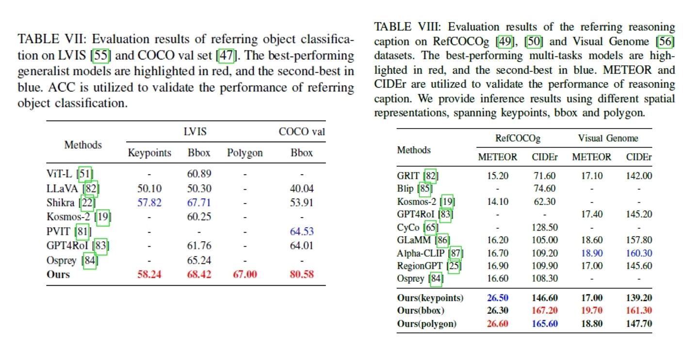

# SCALAR: Scene-Aware Framework for Efficient and Generalized Spatial-Concept Alignment

This repository is a PyTorch implementation of the SCALAR proposed in *SCALAR: Scene-Aware Framework for Efficient and Generalized Spatial-Concept Alignment* (submitted)


In this paper, we propose SCALAR, a novel scene-aware framework for multi-modal large language models (MLLMs) to align the spatial representation of vision models with the concept knowledge in LLMs. 
    Our framework progresses through two training phases: supervised alignment and open-world reinforced fine-tuning.
    Concerning the supervised alignment, we devise hierarchical concept chains to reconstruct visual-language corpora, enabling efficient spatial relationship decoding via an activated lightweight transformer driven by the proposed T-distributed contrastive loss. 
    Beyond that, the subsequent reinforced fine-tuning employs the proposed consistency reward to stimulate self-evolution in the open world without annotations, enhancing generalization through iterative spatial-concept refinement. 
    Moreover, multi-dimensional spatial representations and heterogeneous knowledge formats are jointly optimized across both training stages, also paving ways for versatile human-AI interaction paradigms. 
    Extensive experiments demonstrate the efficiency and generalization of SCALAR through 5 tasks across 8 large-scale datasets with state-of-the-art performance, spanning visual grounding and complex scene-aware understanding. Moreover, ablation studies systematically investigate the critical contributions of reinforced fine-tuning and multi-task joint training. 
    Finally, we release a new multi-task VG dataset emphasizing scene-object relations along with code.


The code in this repo is copied/modified from [BLIP2](https://github.com/salesforce/LAVIS).


## Installation

```bash
pip install -r requirements.txt
```

Meanwhile, you need to follow blip2's guidelines to download the datasets and checkpoints of large language models as the pre-trained model. 


## Experiments

Take vicuna7b as an example of training:

```bash
bash train-vicuna7b.sh
```

And, we provide test code for multiple GPUs:


```bash
bash predict.sh
```


## Results


### Accurate Alignment for Spatial Representation


Quantitatively, Table \ref{tab:vg-results} presents a comparison of referring bbox detection results between our model and various types of grounding models, covering specialized models and generalist models. It clearly demonstrates that our method achieves superior performance across all test datasets. Notably, in the testB split of RefCOCO and RefCOCO+, our model outperforms other methods by a significant margin. This highlights the superiority of our approach in effectively handling the referring expression comprehension with bounding boxes, particularly for non-people objects. We argue this improvement primarily stems from the cross-domain generalization capability of reinforcement fine-tuning, which effectively transfers domain-specific knowledge acquired from only-people datasets to non-people targets.


### Elaborate Scene-Aware Understanding





The performance of object classification is evaluated on LVIS and COCO 2017 datasets using classification accuracy. As shown in Table VII, we achieve excellent results in the referring object classification task across two datasets with various spatial prompts. Concerning COCO dataset, there is an approximately 15% improvement in the ACC values with the bbox prompt compared to the second best method of PVIT. It corroborates our main contributions of elaborate scene-aware understanding with accurate spatial-concept alignment.


We further evaluate the region-level reasoning ability of our model on the close-set RefCOCOg and open-set Visual Genome datasets, as exhibited in Table VIII. In terms of the RefCOCOg dataset, SCALAR achieves excellent results on the RefCOCOg dataset, with improvements of more than 9.7 and 38.7 in METEOR and CIDEr scores, respectively, compared to the second-best results. It is evidence that our model caters to the requirements of complicated scene-aware understanding. Beyond that, we conduct zero-shot experiments on Visual Genome. The superior performances corroborate our main contributions of reinforced fine-tuning, which enhances the generalization and robustness of spatial-concept alignment in the open world. Moreover, there is no obvious difference among the results obtained by various visual prompts.
